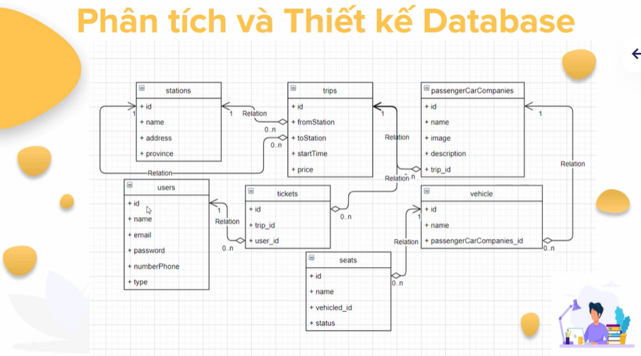
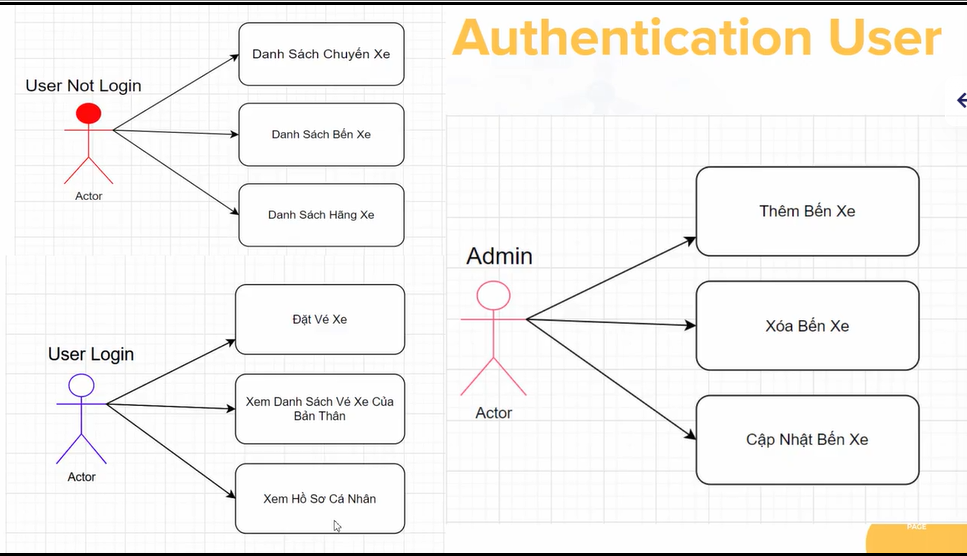
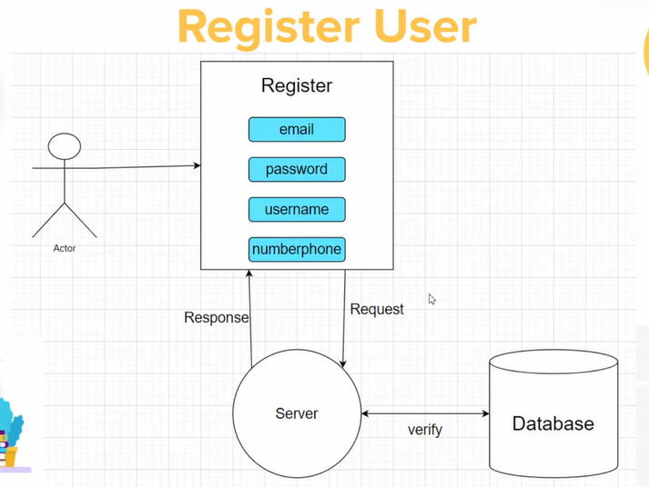
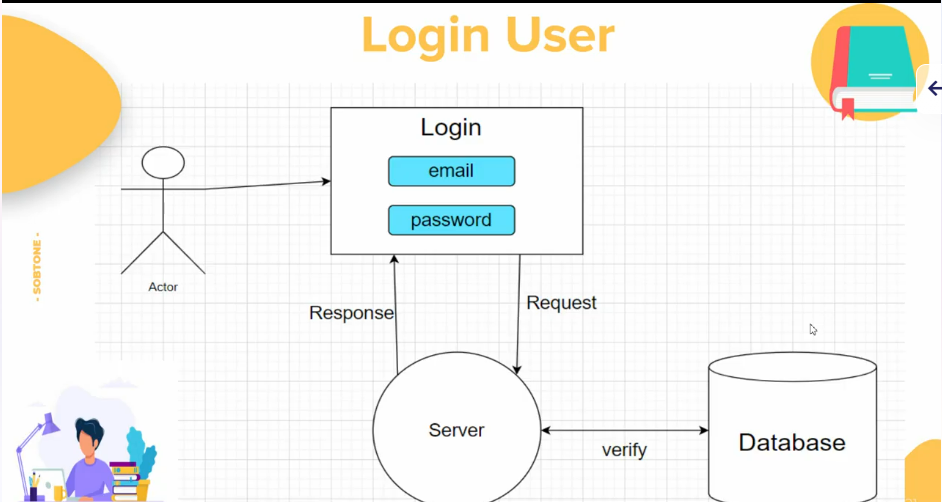
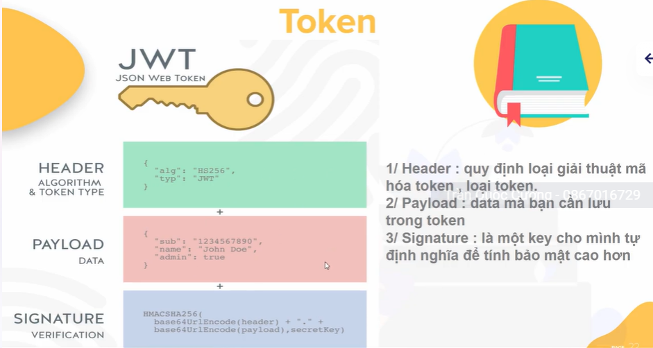
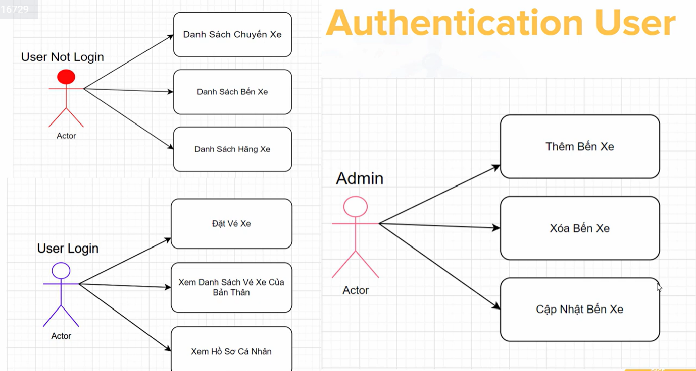
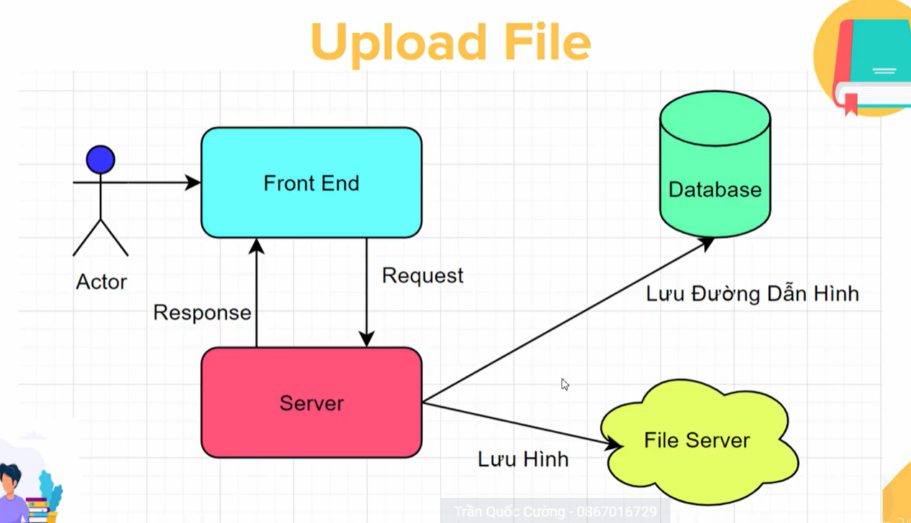

## Các lệnh với sequelize

- [x] `sequelize db:migrate` Run pending migrations
- `sequelize db:migrate:schema:timestamps:add timestamps` Update migration table to have
- `sequelize db:migrate:status` List the status of all migrations
- [x] `sequelize db:migrate:undo` Reverts a migration
- `sequelize db:migrate:undo:all` Revert all migrations ran
- `sequelize db:seed` Run specified seeder
- `sequelize db:seed:undo` Deletes data from the database
- `sequelize db:seed:all` Run every seeder
- `sequelize db:seed:undo:all` Deletes data from the database
- [x] `sequelize db:create` Create database specified by configuration
- [x] `sequelize db:drop` Drop database specified by configuration
- [x] `sequelize init` Initializes project
- `sequelize init:config` Initializes configuration
- [x] `sequelize init:migrations` Initializes migrations
- [x] `sequelize init:models` Initializes models
- `sequelize init:seeders` Initializes seeders
- `sequelize migration:generate` Generates a new migration file
- [x] `sequelize migration:create` Generates a new migration file
- `sequelize model:generate` Generates a model and its migration
- [x] `sequelize model:create` Generates a model and its migration
- `sequelize seed:generate` Generates a new seed file
- `sequelize seed:create` Generates a new seed file

## Tạo model

Chạy lệnh: `yarn sequelize-cli model:generate --name Station --attributes name:string,address:string,province:string`

## Chạy các function trong migrate để tạo table

Chạy lệnh: `yarn sequelize-cli db:migrate`

## Phân quyền User




## Hash mật khẩu

Dùng bcrypjs [link](https://www.npmjs.com/package/bcryptjs)
Cài đặt: `yarn add bcryptjs`
Sử dụng:

##### Tạo ra một chuỗi ngẫu nhiên - tối đa n ký tự

`const salt = bcrypt.genSaltSync(10);`

##### Mã hóa chuỗi ngẫu nhiên vừa tạo ra + password

`const hashPassword = bcrypt.hashSync(password, salt);`

##### Set defaultValue cho type

Vào trong migrate, add thêm `defaultValue: "client"`
Để chạy được, cần chạy 2 lệnh trong terminal

1. `yarn sequelize-cli db:migrate:undo`
2. `yarn sequelize-cli db:migrate`



#



### Cài đặt JWT (JsonWebToken)

Cài đặt: `yarn add jsonwebtoken`
`const jwt = require("jsonwebtoken");`
Tham khảo: [JsonWebToken](https://www.npmjs.com/package/jsonwebtoken)
jwt.sign dùng để mã hóa mật khẩu, trong đó payload có thể bao gồm nhiều thông tin: email, password, phone,...
`const jwt.sign(payload, secret-key, thoi-gian-het-han)`


**Authentication:** xác nhận xem đăng nhập có thành công hay không, liên quan đến token
**Authorize:** phân quyền user, xem user nào có quyền nào, liên quan đến type



Thư viện hỗ trợ upload file của NodeJs
Tham khảo: [multer](https://www.npmjs.com/package/multer)
Cài đặt: `yarn add multer`

Trong userRouter, thêm phương thức post để upload file, hình ảnh
`const multer = require("multer")`
`const upload = multer({dest: './uploads/avatar'})`

Trong postman, dùng phương thức post và ở phần body, sử dụng phương thức form-data để đính kèm data

- **key:** avatar, vì middleware có truyền tham số là "avatar", **middleware do multer đã cấu hình sẵn, mình không cần phải code**
- **value:** đường dẫn dẫn đến file đó, và trên server nó sẽ lưu vào thư mục đã cấu hình trong `{dest: [folder path]}`

Trên thực tế, người ta sẽ tạo trước chỗ lưu hình ảnh trên server và tên hình có đuôi .png/.jpg trước khi tạo biến upload. Vì thế xuất hiện biến storage

```
const storage = multer.diskStorage({
    // Các thuộc tính của diskStorage(lưu vào ổ đĩa) thì được định nghĩa bằng 1 function(req, file, cb){}
    // function đó nhận 3 tham số: req:request, file: tên file đã upload lên server và cb: callback
  destination: function (req, file, cb) {
    cb(null, "../public"); // set up chỗ cần lưu file
  },
  filename: function (req, file, cb) {
    cb(null, file.originalname); // đặt lại tên cho file
  },
});
```

Biến `storage` này được sử dụng trong `upload`:
`const upload = multer({ storage: storage });`

**_Để test tính năng đã làm, coder thường tạo ra thư mục playground_**

Trong biến upload, viết thêm một function để check xem extension của file đã hợp lệ hay chưa. ta viết đoạn code sau

```
fileFilter: function (req, file, cb) {
    const extensionImageList = [".png", ".jpg"];
    const extension = file.originalname.slice(-4).toLowerCase();
    const check = extensionImageList.includes(extension);
    if (check) {
      cb(null, true);
    } else {
      cb(new Error("Extension is invalid!"));
    }
  },
```

Ngoài ra, chúng ta còn có thể giới hạn các thuộc tính của file đó như: size, encoding... [tham khảo](https://www.npmjs.com/package/multer#api)

# Thêm đường link avatar vào database

Vào chỉnh sửa file user.controllers.js

# Tạo thư mục trước khi config destination của storage

(Nếu không tạo folder trước thì khi runtime sẽ bị lỗi)
Cài đặt: `yarn add mkdirp`
Tham khảo: [mkdirp](https://www.npmjs.com/package/mkdirp)
Sử dụng: `const made = mkdirp.sycn("file-path you want to create before using")`

# Xử lý default avatar cho user

Nếu không có hình ảnh avatar mặc định, khi gọi hàm hiển thị UI, hàm sẽ map url ở database nhưng hiện tại lúc đó avatar đang mang giá trị là null.
Cài đặt: `yarn add gravatar`
Tham khảo: [gravatar](https://www.npmjs.com/package/gravatar)

# Tạo Model Trip trong database

Chạy lệnh (tạo model trong project): `yarn sequelize-cli model:generate --name Trip --attributes startTime:date,price:float`
Chạy lệnh (tạo table trong database): `yarn sequelize-cli db:migrate`

Liên kết 2 model (Station và trip) trong VSCode
Ở file station.js:

```
static associate({ Trip }) {
      this.hasMany(Trip, { foreignKey: "fromStation" });
    }
```

Ở file trip.js:

```
static associate({ Station }) {
      this.belongsTo(Station, { foreignKey: "fromStation" });
    }
```

Ở file migrate trip.js, tạo thêm fields fromStation

```
 fromStation: {
        type: Sequelize.INTEGER,
        references: {
          model: "stations",
          key: "id",
        },
      },
```

Sau đó chạy các lệnh `yarn sequelize-cli db:migrate:undo`, `yarn sequelize-cli db:migrate` để refresh lại database


Cài đặt: `yarn add express-fingerprint`
Tham khảo: [Link](https://www.npmjs.com/package/express-fingerprint)
